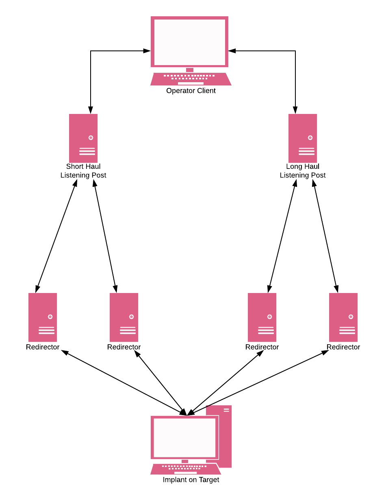
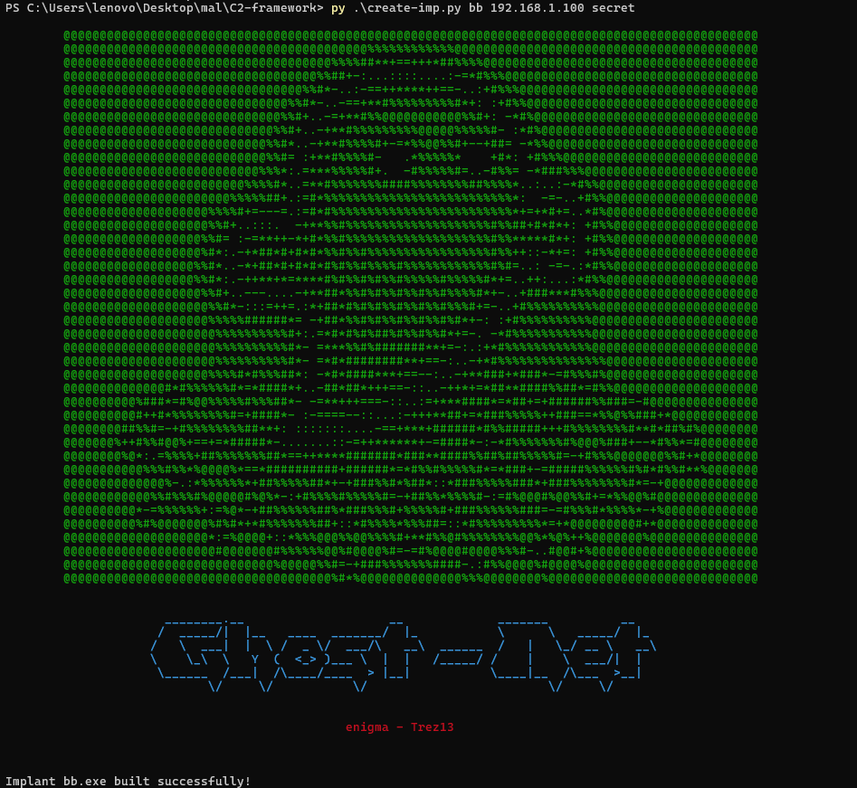
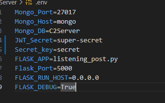
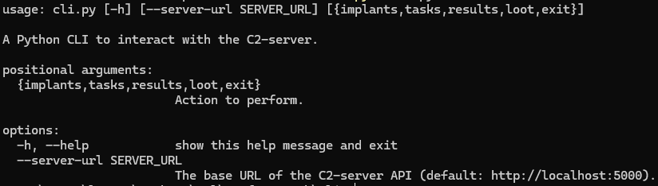

# C2 Framework
<br />
<div align="center">

  <h3 align="center">Ghost-Net C2 - Framework</h3>
  </p>
</div>

**Overview**
---
This is Command and Control (C2) Framework is designed by [**Mohamed Masmoudi**](https://github.com/enigma522) and [**Moahemd Malek Gharbi**](https://github.com/Malek-trez) as part of the a summer intership at [**Pwn&Patch**](https://www.pwnandpatch.com/) to facilitate red team operations. 

**Architecture**
---
The framework includes:

1. CLI: Command-line interface for interacting with the implant.
2. C2 Server: The server-side component that controls and communicates with the implant.
3. Implant: A malware that runs on the target machine. (windows/linux)
<br />
<div align="center">

  <h3 align="center">C2 - Framework</h3>
  </p>
</div>

**Features**
---
- Secure communication between implant and C2 server.
- Easy-to-use CLI for managing implants.
- Real-time data collection and command execution.
- modulare implemantion that makes it easy to add more featres.
  
**Installation**
---

1. Prerequisites
   
- Go (for implant development)
- Docker (for C2 server)
- Python (for C2 server)

2. Clone the Repository

```shell
git clone https://github.com/enigma522/C2-framework
cd c2-framework
```

3. Setting Up the Implant
 
To set up the implant, you need to use the create_implant.py script. Follow these steps:

- Ensure you have Python installed on your machine.
- Change the working directory to the c2-framework directory.
- Run the create_implant.py script with the required parameters: implant_name, ip-C2, and secret.

```shell
python create_implant.py <implant_name> <ip-C2> <secret>
```
- `implant_name`: The desired name for your implant binary.
- `ip-C2`: The IP address of your C2 server. (You can use an Azure VM for this.)
- `secret`: The secret key that allows the implant to communicate with the C2 server. This key should be set in the .env file of the C2 server.
<br />
<div align="center">

</div>


5. Setting Up the C2 Server:
- Ensure Docker is installed on your machine.
- Update the .env file with the necessary environment variables,
- including the secret key for the implant communication.
<br />
<div align="center">

</div>

Run the Docker Compose to start the C2 server:

```shell
docker-compose up -d
```

- This will build and start the C2 server as a Docker container in detached mode.

6. Running the CLI

    Navigate to the cli directory:

```shell
cd cli
```
- Use the CLI to interact with the C2 server and manage implants:

```shell
python cli.py -h
```
- The CLI provides various commands to manage implants, execute commands on target machines, and collect data in real-time.
<br />
<div align="center">

</div>
<!-- CONTRIBUTING -->
## Contributing

Contributions are what make the open source community such an amazing place to learn, inspire, and create. Any contributions you make are **greatly appreciated**.

If you have a suggestion that would make this better, please fork the repo and create a pull request. You can also simply open an issue with the tag "enhancement".
Don't forget to give the project a star! Thanks again!

1. Fork the Project
2. Create your Feature Branch (`git checkout -b feature/AmazingFeature`)
3. Commit your Changes (`git commit -m 'Add some AmazingFeature'`)
4. Push to the Branch (`git push origin feature/AmazingFeature`)
5. Open a Pull Request

<p align="right">(<a href="#readme-top">back to top</a>)</p>


<!-- CONTACT -->
## Contact

Moahemd Masmoudi ~ enigma - mohamedmasmoudi745@gmail.com  
Mohamed Malek Gharbi ~ Trez13  - melek.gharbi1@gmail.com

<p align="right">(<a href="#readme-top">back to top</a>)</p>

